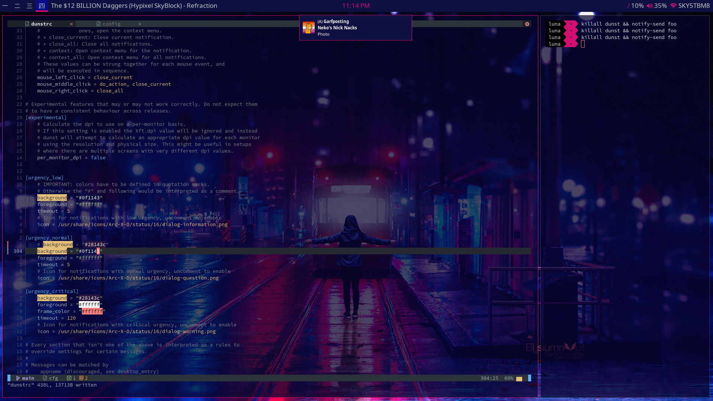

<h1 align="center">
Dotfiles
</h1>

this is just a gitrepo i made it my .config XD, 99% of the stuff in the rofi distro wasnt made by
me its <a href="https://github.com/adi1090x/rofi">here</a> but i tracked it anyway cause i made some
changes but you should get it from the link provided tbh cause it comes with an install script

<h2 align="center"> Programs </h2>

bar: Polybar  
WM: i3  
term: xfce terminal  
notifications: dunst  
lock: i3lock-color  
os: EndeavourOS  

<h2 align="center"> pictures </h2>
  
  
